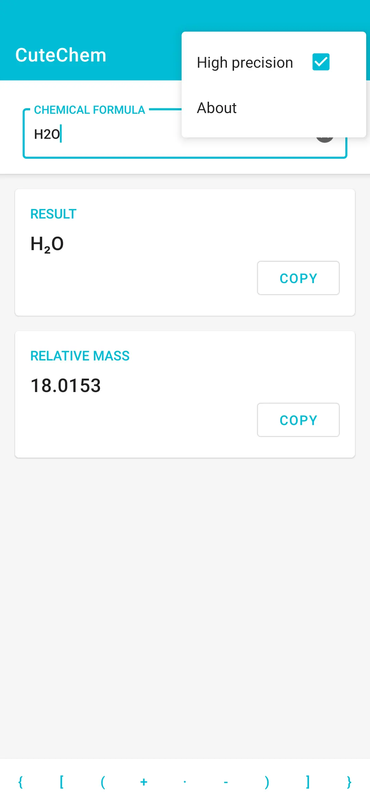

**English** | [简体中文](https://github.com/tasy5kg/CuteChem/blob/main/README_zh-rCN.md)

# CuteChem

## Introduction

By typing a chemical formula, CuteChem will corrects its superscript and subscript and calculates its relative mass.

## Screenchot

  

 

## Download

[Github Releases](https://github.com/tasy5kg/CuteChem/releases) | [Coolapk](https://www.coolapk.com/apk/me.tasy5kg.cutechem)

## Dependencies

```
androidx.appcompat:appcompat:1.2.0
com.google.android.material:material:1.2.1
com.googlecode.aviator:aviator:5.1.4
```