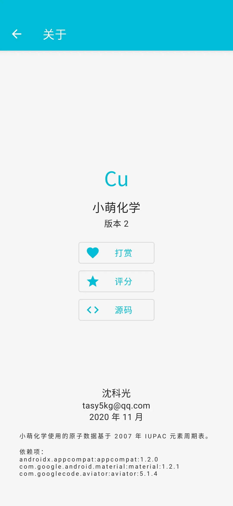

[English](https://github.com/tasy5kg/CuteChem/blob/main/README.md) | **简体中文**

# 小萌化学

## 简介

输入化学式，小萌化学将标出上标和下标，并算出相对质量。

## 截图

  

 

## 下载

[Github Releases](https://github.com/tasy5kg/CuteChem/releases) | [酷安](https://www.coolapk.com/apk/me.tasy5kg.cutechem)

## 依赖项

```
androidx.appcompat:appcompat:1.2.0
com.google.android.material:material:1.2.1
com.googlecode.aviator:aviator:5.1.4
```